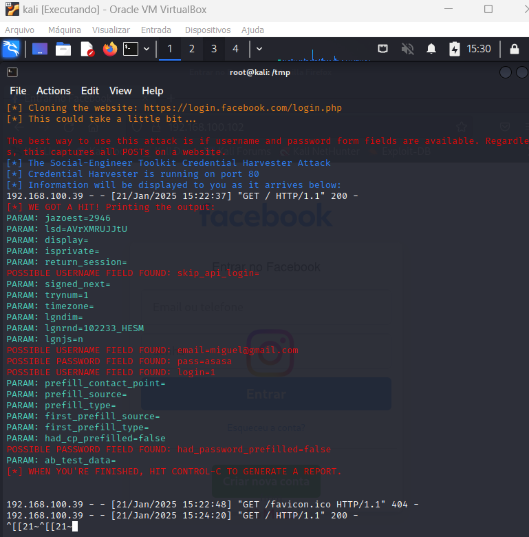

# Phishing para captura de senhas do Facebook

### Ferramentas

- Kali Linux
- setoolkit

### Configuração de rede extra
Como a conexão via ipv6 tinha algum problema na VM, foi necessário também priorizar o tráfego do setoolkit pelo ipv4 com os comandos:

```
    sudo sysctl -w net.ipv6.conf.all.disable_ipv6=1
    sudo sysctl -w net.ipv6.conf.default.disable_ipv6=1
```

### Configurando o Phishing no Kali Linux

- Acesso root: ``` sudo su ```
- Iniciando o setoolkit: ``` setoolkit ```
- Tipo de ataque: ``` Social-Engineering Attacks ```
- Vetor de ataque: ``` Web Site Attack Vectors ```
- Método de ataque: ```Credential Harvester Attack Method ```
- Método de ataque: ``` Site Cloner ```
- Obtendo o endereço da máquina: ``` ifconfig ```
- URL para clone: http://www.facebook.com

### Resutados

